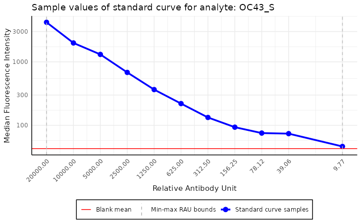
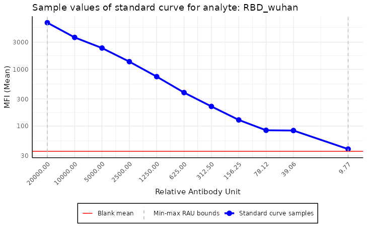
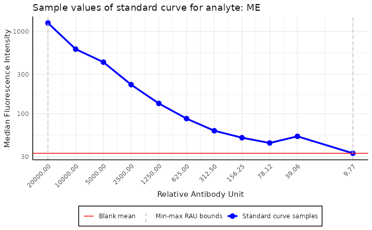
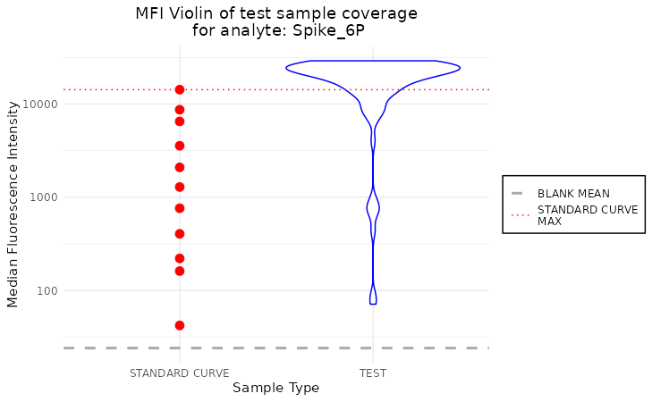
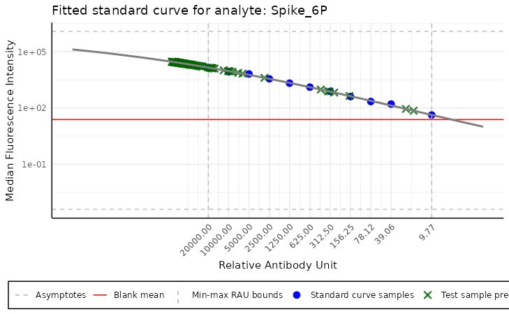

# Basic SerolyzeR functionalities

## Reading the plate object

The basic functionality of the `SerolyzeR` package is reading raw MBA
data. To present the package’s functionalities, we use a sample dataset
from the Covid OISE study, which is pre-loaded into the package. You
might want to replace these variables with paths to your files on your
local disk, to test the package on your data.

Firstly, let us load the dataset as the object.

``` r
library(SerolyzeR)

plate_filepath <- system.file("extdata", "CovidOISExPONTENT.csv", package = "SerolyzeR", mustWork = TRUE) # get the filepath of the csv dataset

layout_filepath <- system.file("extdata", "CovidOISExPONTENT_layout.xlsx", package = "SerolyzeR", mustWork = TRUE)


plate <- read_luminex_data(plate_filepath, layout_filepath) # read the data
```

    #> Reading Luminex data from: /home/runner/work/_temp/Library/SerolyzeR/extdata/CovidOISExPONTENT.csv
    #> using format xPONENT

    #> 
    #> New plate object has been created with name: CovidOISExPONTENT!
    #> 

``` r
plate
```

    #> Plate with 96 samples and 30 analytes

The is an object which encapsulates all the information about the plate,
such as the sample names, analyte names, and the MFI values. For more
details about the object, check the documentation by executing the
command
[`?Plate`](https://mini-pw.github.io/SerolyzeR/reference/Plate.md).

The
[`read_luminex_data()`](https://mini-pw.github.io/SerolyzeR/reference/read_luminex_data.md)
function used above, reads the data from the CSV plate file and the
layout file and outputs the object. This method allows also for more
advanced options, such as overriding the information from the files, or
setting the data reading options, e.g. the Luminex file format
(`xPONENT`, `INTELLIFLEX` or `BIOPLEX`) or the file separators and data
encoding. For more details about the function, we encourage you to
explore the documentation by executing the command
[`?read_luminex_data`](https://mini-pw.github.io/SerolyzeR/reference/read_luminex_data.md).

It also detects automatically the sample types, using an internal method
\[[`translate_sample_names_to_sample_types()`](https://mini-pw.github.io/SerolyzeR/reference/translate_sample_names_to_sample_types.md)\].
The method uses the sample names, sourced either from the layout file or
the CSV plate file, to determine the sample types. The types of samples
are then stored in the `sample_types` field of the plate object. The
sample types are used to distinguish between the standard curve samples,
control samples and the test samples. The documentation of this function
contains more details about the sample types detection.

## Processing the whole plate

Once we have loaded the plate object, we may process it using the
function
\[[`process_plate()`](https://mini-pw.github.io/SerolyzeR/reference/process_plate.md)\].
This function fits a model to each analyte using the standard curve
samples. By default, it computes RAU values for each analyte using the
corresponding model. The computed RAU values are then saved to a CSV
file in a specified folder with the parameter `output_dir` in a file
with specified name `filename`, which by default is based on the plate
name and the normalisation type - this function also allows
normalisation for nMFI values, more details about this method may be
found in the `nMFI` section of this document, or in documentation of
[`?get_nmfi`](https://mini-pw.github.io/SerolyzeR/reference/get_nmfi.md)
function.

This function fits a model to each analyte using the standard curve
samples. By default, it computes Relative Antibody Units (RAU) for each
analyte based on the fitted model. The computed RAU values are saved to
a CSV file in a directory specified by the `output_dir` parameter. The
output file is named according to the `filename` parameter. If no
filename is provided, the function automatically generates one based on
the plate name and the selected normalisation type.

Additionally, this function supports normalisation for normalised Median
Fluorescence Intensity (nMFI) values. More details on this normalisation
approach can be found in the `nMFI` section of this document or in the
documentation of
\[[`get_nmfi()`](https://mini-pw.github.io/SerolyzeR/reference/get_nmfi.md)\].

To get more information about the function, check
[`?process_plate`](https://mini-pw.github.io/SerolyzeR/reference/process_plate.md).

Below, we execute the function on the plate object and save the output
to a temporary directory.

``` r
example_dir <- tempdir(check = TRUE) # create a temporary directory to store the output
df <- process_plate(plate, output_dir = example_dir)
```

    #> Fitting the models and predicting RAU for each analyte

    #> Saving the computed RAU values to a CSV file located in: '/tmp/RtmpkEeKpC/CovidOISExPONTENT_RAU.csv'

``` r
colnames(df)
```

    #>  [1] "Spike_6P"      "ME"            "HKU1_S"        "OC43_NP"      
    #>  [5] "OC43_S"        "HKU1_NP"       "X229E_NP"      "Mumps_NP"     
    #>  [9] "RBD_B16171"    "NL63_NP"       "RBD_B16172"    "RBD_wuhan"    
    #> [13] "NL63_S"        "X229E_S"       "Spike_B16172"  "Spike_B117"   
    #> [17] "Measles_NP"    "Ade5"          "NP"            "Spike_P1"     
    #> [21] "Rub"           "Ade40"         "RBD_B117"      "Spike_B1351"  
    #> [25] "FluA"          "RBD_B1351"     "RBD_P15"       "S2"           
    #> [29] "Spike_omicron" "RBD_omicron"

We can take a look at a slice of the produced dataframe (as not to
overcrowd the article).

``` r
df[1:5, 1:5]
```

    #>          Spike_6P           ME       HKU1_S      OC43_NP       OC43_S
    #> B         4.93097 3.820887e-08     6.863521     5.119414     2.375259
    #> 1/50  20000.00000 2.000000e+04 20000.000000 20000.000000 20000.000000
    #> 1/100  9142.64021 8.255262e+03  8235.456814  8343.787455  8326.659000
    #> 1/200  5906.86818 5.394138e+03  5200.256937  5169.162098  5240.371584
    #> 1/400  2485.64570 2.536966e+03  2602.185159  2626.436852  2556.577201

To automate the processing the plates, we can also use
\[`process_file`\] and \[`process_dir`\] methods. The former processes a
single file, while the latter processes all the files in a directory.

\[`process_file`\] parses the plate file and saves the normalised output
files to the specified directory. An example execution of the function
is shown below.

``` r
process_file(plate_filepath, layout_filepath, output_dir = example_dir, generate_report = FALSE)
```

    #> Reading Luminex data from: /home/runner/work/_temp/Library/SerolyzeR/extdata/CovidOISExPONTENT.csv
    #> using format xPONENT

    #> 
    #> New plate object has been created with name: CovidOISExPONTENT!
    #> 
    #> Processing plate 'CovidOISExPONTENT'
    #> Extracting the raw MFI to the output dataframe
    #> Saving the computed MFI values to a CSV file located in: '/tmp/RtmpkEeKpC/CovidOISExPONTENT_MFI.csv'

    #> Fitting the models and predicting RAU for each analyte

    #> Saving the computed RAU values to a CSV file located in: '/tmp/RtmpkEeKpC/CovidOISExPONTENT_RAU.csv'
    #> Computing nMFI values for each analyte
    #> Saving the computed nMFI values to a CSV file located in: '/tmp/RtmpkEeKpC/CovidOISExPONTENT_nMFI.csv'

    #> Plate with 96 samples and 30 analytes

It saves `RAU` and `nMFI` values to the `output_dir`, working similarly
to the
\[[`process_plate()`](https://mini-pw.github.io/SerolyzeR/reference/process_plate.md)\]
function. Additionally it has an option to produce a single plate
report, which can be enabled with `generate_report = TRUE` parameter.
The report is saved in the same directory as the output files, with the
name based on the plate name. For more detailed description of the
reports, we refer to the .

\[[`process_dir()`](https://mini-pw.github.io/SerolyzeR/reference/process_dir.md)\]
processes all the files in the specified directory. The description of
this method can be found in the separate .

## Quality control and normalisation details

Apart from the
[`process_plate()`](https://mini-pw.github.io/SerolyzeR/reference/process_plate.md)
function, the package provides a set of methods allowing for more
detailed and advanced quality control and normalisation of the data.

### Plate summary and details

After the plate is successfully loaded, we can look at some basic
information about it.

``` r
plate$summary()
```

    #> Summary of the plate with name 'CovidOISExPONTENT':
    #> Plate examination date: 2022-05-12 18:17:40
    #> Total number of samples: 96
    #> Number of blank samples: 1
    #> Number of standard curve samples: 11
    #> Number of positive control samples: 0
    #> Number of negative control samples: 0
    #> Number of test samples: 84
    #> Number of analytes: 30

``` r
plate$summary(include_names = TRUE) # more detailed summary
```

    #> Summary of the plate with name 'CovidOISExPONTENT':
    #> Plate examination date: 2022-05-12 18:17:40
    #> Total number of samples: 96
    #> Number of blank samples: 1
    #> Number of standard curve samples: 11
    #> Sample names: '1/50', '1/100', '1/200', '1/400', '1/800', '1/1600', '1/3200', '1/6400', '1/12800', '1/25600', '1/102400'
    #> Number of positive control samples: 0
    #> Number of negative control samples: 0
    #> Number of test samples: 84
    #> Number of analytes: 30

``` r
plate$sample_names[1:5] # print some of the sample names
```

    #> [1] "B"     "1/50"  "1/100" "1/200" "1/400"

``` r
plate$analyte_names[1:4] # print some of the analyte names
```

    #> [1] "Spike_6P" "ME"       "HKU1_S"   "OC43_NP"

The summary can also be accessed using the built-in generic method
`summary.Plate()`.

``` r
summary(plate)
```

    #> Summary of the plate with name 'CovidOISExPONTENT':
    #> Plate examination date: 2022-05-12 18:17:40
    #> Total number of samples: 96
    #> Number of blank samples: 1
    #> Number of standard curve samples: 11
    #> Number of positive control samples: 0
    #> Number of negative control samples: 0
    #> Number of test samples: 84
    #> Number of analytes: 30

### Quality control

The package can plot the RAU along the MFI values, allowing manual
inspection of the standard curve.

``` r
plot_standard_curve_analyte(plate, analyte_name = "OC43_S")
```



We can also plot the standard curve for different analytes and data
types. A list of all available analytes on the plate can be accessed
using the command `plate$analyte_names`.

By default, all the operations are performed on the `Median` value of
the samples; this option can be selected from the `data_type` parameter
of the function.

``` r
plot_standard_curve_analyte(plate, analyte_name = "RBD_wuhan", data_type = "Mean")
```



``` r
plot_standard_curve_analyte(plate, analyte_name = "RBD_wuhan", data_type = "Avg Net MFI")
```


This plot may be used to assess the standard curve’s quality and
anticipate some potential issues with the data. For instance, if we
plotted the standard curve for the analyte, `ME`, we could notice that
the `Median` value of the sample with RAU of `39.06` is abnormally
large, which may indicate a problem with the data.

``` r
plot_standard_curve_analyte(plate, analyte_name = "ME")
```


``` r
plot_standard_curve_analyte(plate, analyte_name = "ME", log_scale = "all")
```



The plotting function has more options, such as selecting which axis the
log scale should be applied or reversing the curve. More detailed
information can be found in the function documentation, accessed by
executing the command
[`?plot_standard_curve_analyte`](https://mini-pw.github.io/SerolyzeR/reference/plot_standard_curve_analyte.md).

Another valuable method of inspecting the potential errors of the data
is
[`plot_mfi_for_analyte()`](https://mini-pw.github.io/SerolyzeR/reference/plot_mfi_for_analyte.md).
This method plots the MFI values of standard curve samples for a given
analyte along the boxplot of the MFI values of the test samples.

It helps identify the outlier samples and check if the test samples are
within the range of the standard curve samples.

``` r
plot_mfi_for_analyte(plate, analyte_name = "OC43_S")
```


``` r
plot_mfi_for_analyte(plate, analyte_name = "Spike_6P")
```



For the `Spike_6P` analyte, the MFI values don’t fall within the range
of the standard curve samples, which could be problematic for the model.
The test RAU values will be extrapolated (up to a point) from the
standard curve, which may lead to incorrect results.

The package allows also a straightforward way to adjust the MFI values
using the background samples. To do so, we can use the
`plate$blank_adjustment` method, as below:

``` r
plate$blank_adjusted # verify if the data is already adjusted
```

    #> [1] FALSE

``` r
plate$blank_adjustment()
```

    #> Plate with 96 samples and 30 analytes

### Normalisation

After inspection, we may create the model for the standard curve of a
specific antibody. The model is fitted using the `nplr` package, which
provides a simple interface for fitting n-parameter logistic regression
models. Still, to create a more straightforward interface for the user,
we encapsulated this model into our own class called `Model` for
simplicity. The detailed documentation of the class can be found by
executing the command
[`?Model`](https://mini-pw.github.io/SerolyzeR/reference/Model.md).

The model is then used to predict the RAU values of the samples based on
the MFI values.

#### RAU vs dilution

To distinguish between actual dilution values (the ones known for the
standard curve samples) from the dilution predictions (obtained using
the fitted standard curve), we introduced into our package a unit called
RAU (Relative Antibody Unit) which is equal to the dilution
**prediction** multiplied by a \\1,000,000\\ to provide a more readable
value.

#### Inner nplr model

`nplr` package fits the model using the formula:

\\ y = B + \frac{T - B}{\[1 + 10^{b \cdot (x\_{mid} - x)}\]^s},\\ where:

- \\y\\ is the predicted value, MFI in our case,

- \\x\\ is the independent variable, dilution of the standard curve
  samples in our case,

- \\B\\ is the bottom plateau - the right horizontal asymptote,

- \\T\\ is the top plateau - the left horizontal asymptote,

- \\b\\ is the slope of the curve at the inflection point,

- \\x\_{mid}\\ is x-coordinate at the inflection point,

- \\s\\ is the asymmetric coefficient.

This equation is referred to as the Richards’ equation. More information
about the model can be found in the `nplr` package documentation.

#### Predicting RAU

By reversing that logistic function, we can predict the dilution of the
samples based on the MFI values. The RAU value is then the predicted
dilution of the sample multiplied by \\1,000,000\\.

To limit the extrapolation error from above (values above maximum RAU
value for the standard curve samples), we clip all predictions above to
\\M\\ where `over_max_extrapolation` is user controlled parameter to the
[`predict.Model()`](https://mini-pw.github.io/SerolyzeR/reference/predict.Model.md)
function. By default `over_max_extrapolation` is set to \\0\\.

> Warning: High dose hook effect affects the prediction truncation
> (clipping).

When a high dose hook effect is detected we exclude from standard curve
calculations the samples that have dilutions higher or equal to 1/200.
This will cause a truncation of values to the next greatest dilution
multiplied by \\1,000,000\\.

#### Usage

By default, the `nplr` model transforms the x values using the log10
function. To create a model for a specific analyte, we use the
`create_standard_curve_model_analyte` function, which fits and returns
the model for the analyte.

``` r
model <- create_standard_curve_model_analyte(plate, analyte_name = "OC43_S")

model
```

    #> Instance of the Model class fitted for analyte ' OC43_S ': 
    #>  - fitted with 5 parameters
    #>  - using 11 samples
    #>  - using log residuals (mfi):  TRUE 
    #>  - using log dilution:  TRUE 
    #>  - top asymptote: 28415.06 
    #>  - bottom asymptote: 38.60886 
    #>  - goodness of fit: 0.9970645 
    #>  - weighted goodness of fit: 0.9998947

Since our `model` object contains all the characteristics and parameters
of the fitted regression model. The model can be used to predict the RAU
values of the samples based on the MFI values. The output above shows
the most critical parameters of the fitted model.

The predicted values may be used to plot the standard curve, which can
be compared to the sample values.

``` r
plot_standard_curve_analyte_with_model(plate, model, log_scale = c("all"))
```


``` r
plot_standard_curve_analyte_with_model(plate, model, log_scale = c("all"), plot_asymptote = FALSE)
```


As we can see below, when predicting RAU for analytes for which we
observed the high dose hook effect, the truncation level changes to a
RAU value corresponding to a first sample with dilution below 1/200
(1/400 in this case, RAU = 2500).

``` r
model_hdh <- create_standard_curve_model_analyte(plate, analyte_name = "RBD_omicron")
plot_standard_curve_analyte_with_model(plate, model_hdh, log_scale = c("all"))
```


Apart from the plotting, the package can predict the values of all the
samples on the plate.

``` r
mfi_values <- plate$data$Median$OC43_S
head(mfi_values)
```

    #> [1]   43.0 4193.0 1982.0 1308.0  681.0  365.5

``` r
predicted_rau <- predict(model, mfi_values)

head(predicted_rau)
```

    #>            RAU    MFI
    #> 1     2.375259   43.0
    #> 2 20000.000000 4193.0
    #> 3  8326.659000 1982.0
    #> 4  5240.371584 1308.0
    #> 5  2556.577201  681.0
    #> 6  1242.668792  365.5

The dataframe contains original MFI values and the predicted RAU values
based on the model.

In order to allow extrapolation from above (up to a certain value) we
can set `over_max_extrapolation` to a positive value. To illustrate that
we can look at prediction plots. The
[`plot_standard_curve_analyte_with_model()`](https://mini-pw.github.io/SerolyzeR/reference/plot_standard_curve_analyte_with_model.md)
takes any additional parameters and passes them to a `predict` method so
we can visually see the effect of the `over_max_extrapolation`
parameter.

``` r
model <- create_standard_curve_model_analyte(plate, analyte_name = "Spike_6P")
plot_standard_curve_analyte_with_model(plate, model, log_scale = c("all"))
```


``` r
plot_standard_curve_analyte_with_model(plate, model, log_scale = c("all"), over_max_extrapolation = 100000)
```



### nMFI

In some cases, the RAU values cannot be reliably calculated. This may
happen when the MFI values of test samples are way higher than those of
the standard curve samples. In that case, to avoid extrapolation but to
be still able to compare the samples across the plates, we introduced a
new unit called nMFI (Normalized MFI). The nMFI is calculated as the MFI
value of the test sample divided by the MFI value of the standard curve
sample with the selected dilution value.

nMFI values of the samples can be calculated in two ways - using the
[`get_nmfi()`](https://mini-pw.github.io/SerolyzeR/reference/get_nmfi.md)
function or with the
[`process_plate()`](https://mini-pw.github.io/SerolyzeR/reference/process_plate.md)
function that also saves the output into the CSV file by setting the
`normalisation_type` parameter to `nMFI` in the
[`process_plate()`](https://mini-pw.github.io/SerolyzeR/reference/process_plate.md)
function. By default the output will be saved as a file with the same
name as the plate name but with the `_nMFI` suffix.

``` r
nmfi_values <- get_nmfi(plate)

# process plate with nMFI normalisation

df <- process_plate(plate, output_dir = example_dir, normalisation_type = "nMFI")
```

    #> Computing nMFI values for each analyte
    #> Saving the computed nMFI values to a CSV file located in: '/tmp/RtmpkEeKpC/CovidOISExPONTENT_nMFI.csv'

``` r
df[1:5, 1:5]
```

    #>          Spike_6P        ME     HKU1_S    OC43_NP     OC43_S
    #> B     0.006735897 0.1466667 0.03318584 0.03409836 0.06314244
    #> 1/50  4.001122649 5.6133333 5.61172566 6.11081967 6.15712188
    #> 1/100 2.436289644 2.7000000 2.72953540 2.79934426 2.91042584
    #> 1/200 1.824586023 1.8777778 1.83849558 1.82557377 1.92070485
    #> 1/400 1.000000000 1.0000000 1.00000000 1.00000000 1.00000000
